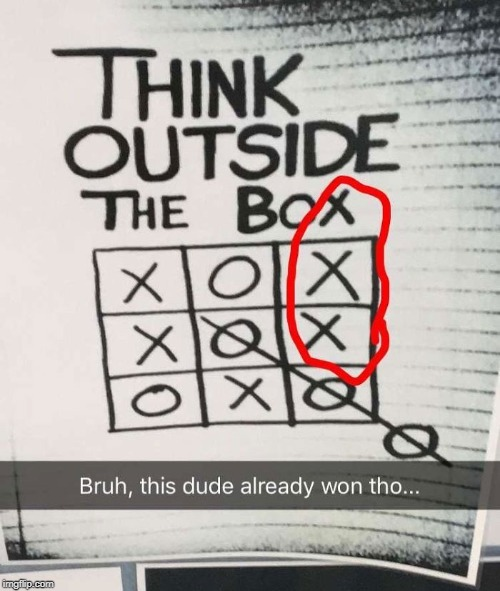
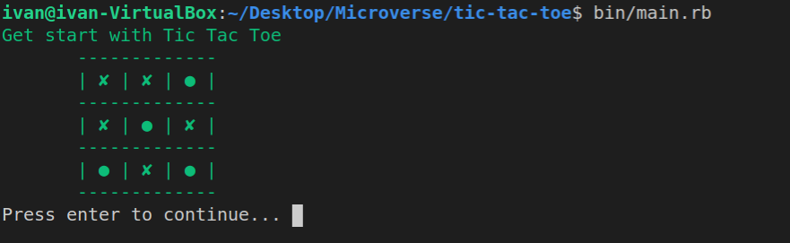
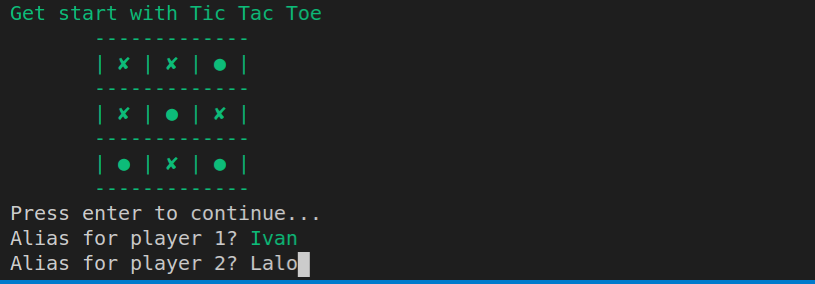
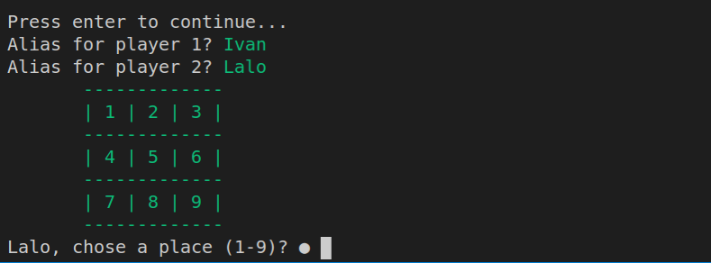
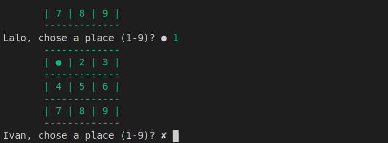
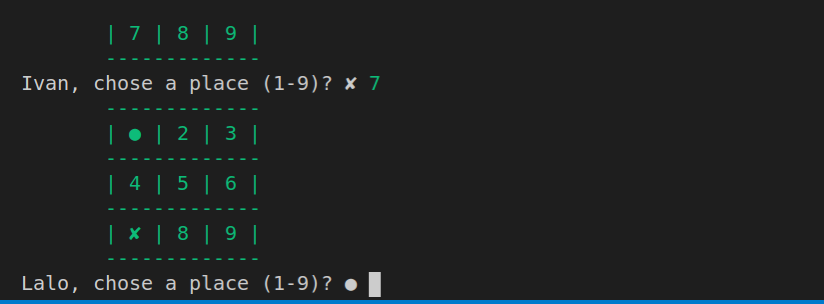
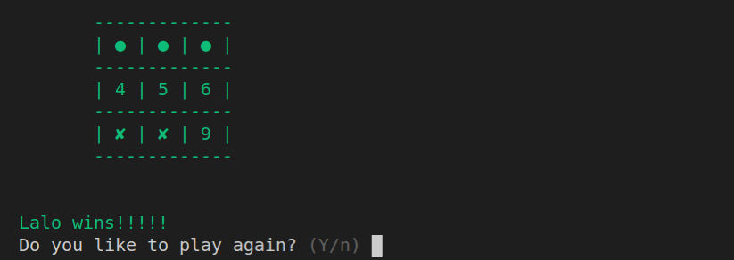
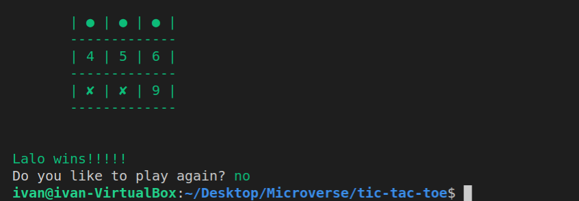

# Tic-Tac-Toe Game

> Let's play Tic Tac Toe

    

The main goal of this project was to build a Tic Tac Toe game putting in practice the Object Oriented 
Programing (OOP) paradigm. It consist of an interface (bin/main.rb) and two classes (lib/dashboard.rb and lib/player.rb). For the interface I used [TTY prompt component](https://github.com/piotrmurach/tty-prompt#31-symbols).

## Built With

- Ruby
- [TTY prompt component](https://github.com/piotrmurach/tty-prompt#31-symbols)

## How to install the game?

### Prerequisites
- Ruby [installed](https://www.ruby-lang.org/en/downloads/)
- Bundler [installed](https://bundler.io/)

### Install
- Get a local copy of the [game](https://github.com/fivan18/tic-tac-toe)
- Inside the root directory of the game run `bundle install` on the command line

## Instructions to play the game
1. Inside the root directory of the game run bin/main.rb and press enter
  - 
2. Eter the players aliases (the game chose a player randomly to start the game)
  - 
3. Each player choose different places to do their move untill someone wins or there are not more places in the dashboard
  - 
  - 
  - 
  - 
  - 
  - 
4. Press (y/n) to play again or get out of the game
  - 

## Authors

👤 **Ivan Ulises Guzman Sanchez**

- Github: [@fivan18](https://github.com/fivan18)
- Twitter: [@fivanunam](https://twitter.com/fivanunam)
- Linkedin: [fivan](https://www.linkedin.com/in/fivan)

## 🤝 Contributing

Contributions, issues and feature requests are welcome!

Feel free to check the [issues page](https://github.com/fivan18/tic-tac-toe/issues).

## 📝 License

This project is [MIT](README.md) licensed.
